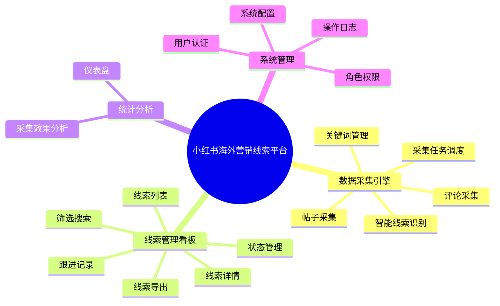
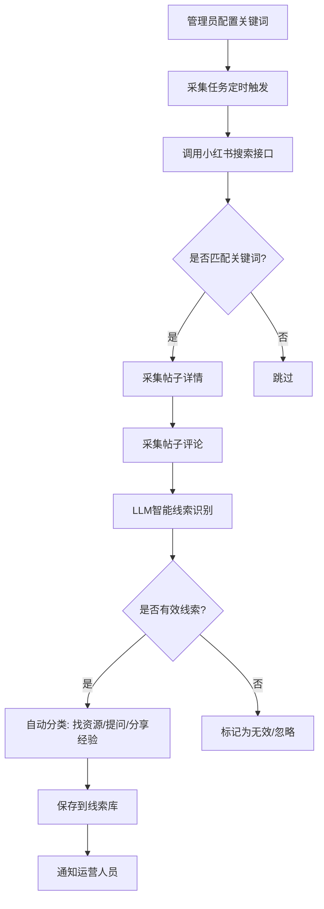

# 小红书海外营销线索平台 — 产品需求文档 (PRD)

## 1. 文档信息

| 字段 | 内容 |
|-----|------|
| 产品名称 | 小红书海外营销线索平台 (XHS Overseas Marketing Leads Platform) |
| 文档版本 | V1.0 |
| 编写日期 | 2026-07-21 |
| 编写人 | 小艺 Claw |
| 最后更新 | 2026-07-21 |

---

## 2. 项目背景

### 2.1 业务目标

海外品牌营销和海外达人营销是当前出海行业的热门赛道。小红书上每天有大量相关讨论：

- **需求方**：品牌方/商家在寻找海外达人资源供应商
- **供给方**：MCN/代理商在展示自己的海外达人资源
- **知识分享**：从业者分享海外营销方法论、案例分析
- **咨询求助**：新手询问如何做海外品牌营销、如何找海外KOL

这些帖子及评论区中的互动，构成了**高质量的海外营销线索**。然而目前缺乏系统化的工具来发现、筛选和管理这些线索。

本平台旨在：
1. **自动发现**：基于关键词组合自动采集小红书上与海外营销相关的帖子和评论
2. **智能识别**：通过 NLP/LLM 自动判断帖子是否为有效线索并分类
3. **线索管理**：提供 PC 端看板，集中查看、筛选、跟进线索
4. **数据沉淀**：持续积累线索数据，形成可检索的线索库

### 2.2 目标用户

| 用户类型 | 用户画像 | 核心诉求 |
|---------|---------|---------|
| 海外营销BD/销售 | 负责拓展海外达人/品牌客户的商务人员，25-35岁 | 快速找到潜在客户线索，了解对方需求，及时跟进转化 |
| MCN机构运营 | 管理海外达人资源的MCN机构运营人员，28-40岁 | 发现找达人资源的品牌方，主动触达合作机会 |
| 市场/增长负责人 | 负责海外市场增长的团队管理者，30-45岁 | 了解市场动态，掌握竞品动向，分配线索给团队成员 |
| 出海创业者/个体户 | 自己做海外品牌的小团队或个人，25-35岁 | 学习海外营销经验，寻找合作方和资源 |

### 2.3 核心价值主张

> **一站式发现、筛选和管理小红书上"找人、找资源、找经验"的海外营销线索，将零散社交内容转化为可跟进商机。**

---

## 3. 产品架构

### 3.1 功能架构图



### 3.2 用户角色定义

| 角色名称 | 角色描述 | 主要权限 |
|---------|---------|---------|
| 超级管理员 | 系统最高权限，负责系统配置和用户管理 | 所有功能 + 用户管理 + 系统配置 + 关键词管理 |
| 运营编辑 | 日常线索管理和跟进的运营人员 | 线索查看/编辑/导出 + 跟进记录 + 数据看板 |
| 只读用户 | 仅查看线索数据，不参与跟进 | 线索查看 + 数据看板（只读） |

---

## 4. 核心业务流程

### 4.1 线索采集流程



### 4.2 线索跟进流程

```mermaid
flowchart TD
    A[运营人员登录看板] --> B[查看新线索列表]
    B --> C{筛选目标线索}
    C --> D[打开线索详情]
    D --> E[查看帖子原文+评论]
    E --> F{判断线索质量}
    F -->|高质量| G[标记"已查看"并添加跟进记录]
    F -->|低质量/无效| H[标记"无效"]
    G --> I[通过小红书私信或其他渠道联系线索方]
    I --> J{转化结果}
    J -->|成功转化| K[标记"已转化"]
    J -->|未转化| L[记录下次跟进时间]
```

---

## 5. 详细功能说明

### 5.1 数据采集引擎

#### 5.1.1 关键词管理（DC-01）

| 字段 | 说明 |
|-----|------|
| **功能编号** | DC-01 |
| **功能描述** | 管理员可创建/编辑/启用/停用关键词组合，系统按生效中的关键词组合去小红书搜索匹配帖子 |
| **前置条件** | 用户具有管理员权限 |
| **优先级** | 🔴 P0 |

**页面元素**：

| 元素 | 类型 | 说明 | 校验规则 |
|-----|------|-----|---------|
| 关键词组名称 | 输入框 | 为这组关键词起一个辨识名称，如"海外达人营销" | 必填，最长 30 字 |
| 搜索关键词 | 标签输入 | 支持多关键词，如"海外达人""海外KOL""海外营销" | 必填，至少 1 个，最多 20 个 |
| 排除词 | 标签输入 | 排除包含这些词的帖子，如"招聘""培训" | 可选 |
| 状态 | 开关 | 启用/停用该关键词组 | 默认启用 |
| 采集频率 | 下拉选择 | 每小时/每6小时/每天/每周 | 默认每天 |

**交互逻辑**：

1. 管理员点击「新建关键词组」
2. 填写关键词组名称、添加搜索关键词、可选添加排除词
3. 选择采集频率 → 点击「保存」
4. 系统实时校验关键词是否合规（无敏感词），保存后立即生效
5. 关键词组列表页支持编辑、启用/停用、删除操作

**异常处理**：

| 异常场景 | 处理方式 |
|---------|---------|
| 关键词组名重复 | 提示"关键词组名称已存在，请更换" |
| 关键词包含敏感词 | 提示"关键词包含平台限制内容，请修改" |
| 未添加任何关键词 | 提示"请至少添加1个搜索关键词" |

---

#### 5.1.2 智能线索识别（DC-05）

| 字段 | 说明 |
|-----|------|
| **功能编号** | DC-05 |
| **功能描述** | 基于 LLM 自动判断帖子是否为有效线索，并自动分类 |
| **前置条件** | 已采集帖子正文+评论内容 |
| **优先级** | 🔴 P0 |

**线索分类规则**：

| 线索类型 | 判断标准 | 示例 |
|---------|---------|---------|
| 🔍 找资源/找供应商 | 帖子明确表达在寻找海外达人资源、MCN合作、海外营销服务商 | "求推荐靠谱的海外达人MCN""有没有做东南亚KOL的机构" |
| ❓ 咨询求助 | 发帖询问海外营销相关问题，如何做、怎么做 | "小白求问海外品牌怎么做小红书营销""海外达人一般怎么报价" |
| 💡 经验分享 | 帖子分享海外营销案例、方法论、踩坑经验 | "复盘一下我们在TikTok投流的ROI""海外达人合作的5个坑" |
| 📢 资源展示 | MCN/代理商展示自己的海外达人资源和案例 | "我们覆盖欧美200+达人，欢迎品牌方来聊" |
| ❌ 无效 | 与海外营销无关，或纯广告无实质内容 | 纯产品推广、完全不相关的日常内容 |

**LLM Prompt 设计原则**：

- 输入：帖子标题 + 正文前 500 字 + 前 10 条评论
- 输出：JSON `{is_valid: bool, lead_type: string, confidence: float, reason: string}`
- 置信度低于 0.7 的自动标记为「待人工复核」

**交互逻辑**：

1. 采集完成后自动触发 LLM 分类
2. 高置信度线索自动入库，状态为「新线索」
3. 低置信度线索入库但标记「待复核」，在列表中高亮提示

---

### 5.2 线索管理看板

#### 5.2.1 线索列表（LM-01）

| 字段 | 说明 |
|-----|------|
| **功能编号** | LM-01 |
| **功能描述** | 以列表形式展示所有采集到的线索，支持分页浏览 |
| **前置条件** | 用户已登录 |
| **优先级** | 🔴 P0 |

**列表展示字段**：

| 列名 | 说明 | 示例 |
|------|------|---------|
| 序号 | 序号 | 1 |
| 帖子标题 | 小红书帖子标题（可点击进入详情） | "求推荐靠谱的海外达人MCN机构" |
| 发布人 | 小红书昵称 | "出海小能手" |
| 线索类型 | 系统判定线索类型 | 🔍 找资源 |
| 采集时间 | 帖子被抓取的时间 | 2026-07-21 10:30 |
| 状态 | 线索跟进状态 | 新线索/已查看/已联系/已转化/无效 |
| 操作 | 操作按钮 | 查看详情 / 标记状态 |

**交互逻辑**：

1. 进入看板默认展示所有线索，按采集时间倒序
2. 支持点击表头排序（按发布时间、采集时间）
3. 每页展示 20 条，底部分页器
4. 点击标题进入线索详情页
5. 支持多选线索后批量标记状态

---

#### 5.1.3 线索详情页（LM-03）

| 字段 | 说明 |
|-----|------|
| **功能编号** | LM-03 |
| **功能描述** | 展示单条线索的完整信息，包括帖子原文、图片、评论、系统判定依据 |
| **前置条件** | 从列表点击进入 |
| **优先级** | 🔴 P0 |

**页面布局**：

- **左侧（60%）**：帖子内容区
  - 帖子标题、发布人昵称 + 头像
  - 帖子正文（完整展示，保留换行和 emoji）
  - 帖子图片（支持点击放大预览）
  - 发布时间、点赞数、收藏数、评论数
  - 「在小红书打开」链接按钮

- **右侧（40%）**：评论 + 线索管理区
  - **评论列表**：展示全部评论，每条含评论人、评论文本、时间
  - **线索判定卡片**：展示系统判定线索类型 + 置信度 + 判定理由
  - **状态操作区**：下拉选择状态 + 「保存」按钮
  - **跟进记录区**：历史跟进记录列表 + 新增跟进记录输入框

---

### 5.3 统计分析

#### 5.3.1 概览仪表盘（ST-01）

| 字段 | 说明 |
|-----|------|
| **功能编号** | ST-01 |
| **功能描述** | 展示关键指标看板，帮助运营负责人掌握线索整体状况 |
| **前置条件** | 用户已登录 |
| **优先级** | 🟡 P1 |

**仪表盘指标卡片**：

| 指标 | 说明 |
|------|------|
| 总线索数 | 累计采集的有效线索总数 |
| 今日新增 | 今日新增的有效线索数 |
| 待处理 | 状态为「新线索」的数量 |
| 已转化 | 状态为「已转化」的数量 |
| 转化率 | 已转化 / 总线索数 × 100% |

**图表区域**：

| 图表 | 类型 | 说明 |
|------|------|---------|
| 线索趋势图 | 折线图 | 近30天每日新增线索数趋势 |
| 线索类型分布 | 饼图 | 各线索类型占比（找资源/咨询/分享/展示） |
| 状态分布 | 柱状图 | 各跟进状态的线索数量分布 |
| 热门关键词 | 词云 | 近期高频出现的搜索关键词 |

---

### 5.4 系统管理

#### 5.4.1 用户登录注册（SM-01）

| 字段 | 说明 |
|-----|------|
| **功能编号** | SM-01 |
| **功能描述** | 用户通过邮箱+密码注册和登录系统 |
| **前置条件** | 无 |
| **优先级** | 🔴 P0 |

**注册流程**：

1. 用户访问登录页 → 点击「注册」
2. 输入邮箱 → 系统发送验证码到邮箱
3. 输入验证码 + 设置密码 → 完成注册
4. 注册成功后自动登录进入看板

**登录流程**：

1. 输入邮箱 + 密码 → 点击「登录」
2. 支持「记住我」功能（7天内免登录）
3. 密码错误超过 5 次 → 锁定账号 30 分钟
4. 支持「忘记密码」→ 邮箱重置密码

---

## 6. 非功能需求

### 6.1 性能要求

| 指标 | 要求 |
|-----|------|
| 页面首屏加载时间 | ≤  Serra 3s |
| 列表滚动加载 | 虚拟滚动，支持 10 万+线索丝滑浏览 |
| API 响应时间（列表查询） | ≤ 200ms |
| API 响应时间（详情查询） | ≤ 500ms |
| 并发用户数 | ≥ 50（首版） |
| 数据采集频率 | 支持每小时/每6小时/每天/每周 |

### 6.2 安全要求

- [x] 用户密码加密存储（bcrypt + salt）
- [x] JWT Token 鉴权，过期自动刷新
- [x] 接口权限校验（角色权限中间件）
- [x] 防 SQL 注入（ORM 参数化查询）
- [x] 防 XSS（输出编码）
- [x] CORS 白名单配置
- [x] 操作日志记录（谁在什么时间做了什么）
- [x] 敏感数据脱敏（手机号/邮箱部分隐藏展示）

### 6.3 兼容性要求

| 维度 | 支持范围 |
|-----|---------|
| 浏览器 | Chrome 90+, Edge 90+, Safari 15+ |
| 设备 | PC（首版仅支持 Desktop Web） |
| 分辨率 | 1920×1080（主要）、1366×768（兼容） |
| 最小屏幕宽度 | 1280px |

### 6.4 数据合规

- **数据采集合规**：仅采集公开可见的帖子和评论内容，不采集私密/仅粉丝可见内容
- **用户隐私**：采集的帖子中如含手机号/邮箱等个人信息，前端展示时脱敏处理
- **数据留存**：线索数据按配置的留存策略自动清理（默认保留 12 个月）
- **小红书平台规范**：遵守小红书 robots.txt 及平台使用规范，采集频率设置合理间隔

---

## 7. 迭代规划

| 版本 | 包含功能 | 预计上线时间 |
|-----|---------|-------------|
| MVP (V1.0) | 关键词管理、帖子采集、评论采集、智能线索识别、线索列表、线索详情、状态管理、用户登录 | 4 周 |
| V1.1 | 筛选搜索、跟进记录、线索导出、采集任务调度、角色权限、概览仪表盘、系统配置 | MVP +  Serra 4 周 |
| V1.2 | 批量操作增强、收藏标记、操作日志、采集效果分析、团队协作统计 | V1.1 + 4 周 |

---

## 8. 技术方案建议

### 8.1 推荐技术栈

| 层级 | 技术选型 | 说明 |
|------|---------|---------|
| 前端框架 | React 18 + TypeScript | 成熟生态，组件化开发 |
| UI 组件库 | Ant Design 5 | 企业级中后台 UI，表格/表单能力强大 |
| 状态管理 | Zustand | 轻量级，适合中等复杂度应用 |
| 图表 | ECharts 5 | 满足仪表盘可视化需求 |
| 后端框架 | Python FastAPI | 异步高性能，适合IO密集型采集任务 |
| ORM | SQLAlchemy 2.0 | 成熟的 Python ORM |
| 数据库 | PostgreSQL 15 | 支持 JSON 字段存储帖子元数据 |
| 缓存 | Redis | 采集任务队列 + 热点数据缓存 |
| 任务队列 | Celery + Redis | 定时采集任务调度 |
| LLM 集成 | OpenAI API / 国内大模型 | 智能线索识别 |

### 8.2 数据库核心表设计概要

```
keywords          — 关键词组配置
posts             — 采集的帖子数据
comments          — 采集的评论数据
leads             — 线索（关联 post + 识别结果）
lead_follow_ups   — 跟进记录
users             — 用户表
roles             — 角色表
operation_logs    — 操作日志
crawl_tasks       — 采集任务记录
```

---

## 9. 附录

### 9.1 术语表

| 术语 | 解释 |
|-----|------|
| 线索 (Lead) | 从小红书帖子中识别出的潜在商机，可能是有找人需求的品牌方、咨询如何做海外营销的新手、分享经验的从业者等 |
| 线索类型 | 系统自动分类的线索类别：找资源/咨询求助/经验分享/资源展示 |
| 采集任务 | 按关键词组合定时执行的小红书搜索+采集任务 |
| 跟进记录 | 运营人员对线索的处理备注，记录沟通进展 |
| 转化 | 线索从发现到最终达成合作的过程完成 |

### 9.2 参考文档

- 小红书开放平台文档（如有API）
- Ant Design Pro 组件文档：https://pro.ant.design
- FastAPI 官方文档：https://fastapi.tiangolo.com

---

*文档结束*
